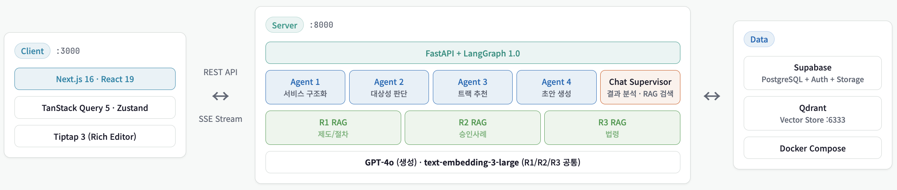

# SandboxIA

규제 샌드박스 신청 컨설팅을 지원하는 AI 멀티에이전트 시스템

## Overview

규제 샌드박스 신청 과정에서 발생하는 신청서 작성의 복잡성, 유사 사례 조사 비효율, 증가하는 수요 대비 컨설턴트 리소스 한계 문제를 해결하기 위해 개발한 서비스입니다.

LangGraph 기반 멀티에이전트 AI 시스템으로, 단순 질의응답형 챗봇이 아닌 서비스 구조화 → 대상성 판단 → 트랙 추천 → 신청서 초안 생성으로 이어지는 상태 기반 파이프라인으로 설계했습니다.

규제 제도, 승인 사례, 도메인 법령 데이터를 활용한 3개의 공용 RAG Tool과 4개의 파이프라인 Agent, Chat Supervisor Agent로 시스템을 분리 설계하고, Retrieval 성능을 정량 평가하여 기술 스택을 선정했습니다.

### 핵심 기능

| 단계   | 기능          | 설명                                          |
| ------ | ------------- | --------------------------------------------- |
| Step 1 | 서비스 구조화 | HWP/PDF 파일 파싱, 서비스 정보 추출 및 정규화 |
| Step 2 | 대상성 판단   | 규제 샌드박스 적용 대상 여부 AI 판단          |
| Step 3 | 트랙 추천     | 신속확인/실증특례/임시허가 중 최적 트랙 추천  |
| Step 4 | 신청서 초안   | 트랙별 신청서 양식 AI 자동 작성 및 편집       |
| 채팅   | AI 상담       | 프로젝트 분석 결과, 규제/법령/사례 실시간 Q&A |

## Architecture



## Tech Stack

| 영역      | 기술                                                                         |
| --------- | ---------------------------------------------------------------------------- |
| Frontend  | Next.js 16, React 19, TypeScript 5, TailwindCSS 4, TanStack Query 5, Zustand |
| Backend   | FastAPI, LangGraph 1.0, LangChain, Pydantic                                  |
| AI/ML     | OpenAI GPT-4o / GPT-4o-mini, Hybrid Search (Dense + SPLADE)                  |
| Vector DB | Qdrant (Production), ChromaDB (Development)                                  |
| Database  | Supabase (PostgreSQL + Storage + Auth)                                       |
| Infra     | Vercel (Frontend), AWS EC2 + Docker Compose (Backend)                        |

## AI Agent Architecture

### LangGraph 멀티에이전트

4개의 파이프라인 에이전트와 채팅 에이전트 그룹(Supervisor + 2 서브에이전트)으로 구성됩니다.

**파이프라인 에이전트**

| Agent                     | 역할                                                | 사용 RAG   |
| ------------------------- | --------------------------------------------------- | ---------- |
| **Service Structurer**    | HWP 파싱 → 서비스 정보 정규화 (Canonical Structure) | R3         |
| **Eligibility Evaluator** | 규제 샌드박스 대상 여부 판단                        | R1, R2, R3 |
| **Track Recommender**     | 신속확인/실증특례/임시허가 트랙 추천                | R1, R2, R3 |
| **Application Drafter**   | 트랙별 신청서 초안 자동 생성                        | R1, R2     |

**채팅 에이전트**

| Agent                | 역할                                                          | 모델        |
| -------------------- | ------------------------------------------------------------- | ----------- |
| **Chat Supervisor**  | 사용자 질문 의도 분류 및 서브 에이전트 라우팅                 | gpt-4o-mini |
| ↳**Results Analyst** | 프로젝트별 분석 결과(대상성, 트랙 추천, 점수 등) 질의응답     | gpt-4o-mini |
| ↳**RAG Expert**      | 규제 제도, 승인 사례, 법령 관련 질의응답 (R1/R2/R3 병렬 검색) | gpt-4o      |

### RAG System

3개의 도메인별 RAG로 컨텍스트 기반 응답을 생성합니다.

| RAG                 | 데이터 소스                                  | 주요 활용                           |
| ------------------- | -------------------------------------------- | ----------------------------------- |
| R1: 규제제도 & 절차 | 트랙별 정의, 절차, 요건, 심사 기준           | 대상성 판단, 트랙 추천, 신청서 작성 |
| R2: 승인사례        | 실증특례/임시허가 승인 사례, 조건, 실증 범위 | 유사 사례 검색, 근거 제공           |
| R3: 도메인별 법령   | 의료법, 전자금융거래법, 개인정보보호법 등    | 규제 쟁점 분석, 법적 근거           |

### RAG 평가

server/eval/r3/configs 에 평가를 위한 조합을 설정하고, Subagent를 활용해 Retrieval 성능을 평가/분석합니다.

| 카테고리  | 지표               | 설명                  |
| --------- | ------------------ | --------------------- |
| Retrieval | Must-Have Recall@K | 필수 조항 검색률      |
|           | Recall@K           | 전체 정답 검색률      |
|           | MRR                | 첫 번째 정답의 역순위 |

## Getting Started

### Prerequisites

- Node.js 20+, pnpm 9+
- Python 3.12+, uv
- Docker (Vector DB용)

### Quick Start

```bash
# 1. 저장소 클론
git clone https://github.com/azultasul/SandboxIA-ai-agent-rag.git
cd SandboxIA-ai-agent-rag

# 2. 환경 변수 설정
cp server/.env.example server/.env
cp client/.env.example client/.env.local
# .env 파일 편집하여 API 키 설정

# 3. 서버 실행 (터미널 1)
cd server
uv sync
uv run python scripts/collect_regulations.py  # RAG 데이터 구축
uv run uvicorn app.main:app --reload

# 4. 클라이언트 실행 (터미널 2)
cd client
pnpm install
pnpm run dev
```

- Frontend: http://localhost:3000
- Backend: http://localhost:8000
- API Docs: http://localhost:8000/docs

자세한 설정은 각 디렉토리의 README를 참고하세요:

- [client/README.md](./client/README.md) - 프론트엔드 설정 및 배포
- [server/README.md](./server/README.md) - 백엔드 설정 및 배포

## Repository Structure

```
.
├── client/                    # Next.js 프론트엔드
│   ├── src/
│   │   ├── app/              # App Router 페이지
│   │   ├── components/       # React 컴포넌트 (ui/, features/, layouts/)
│   │   ├── hooks/            # TanStack Query 훅 (queries/, mutations/, streaming/)
│   │   ├── lib/              # API 클라이언트, 유틸리티
│   │   ├── stores/           # Zustand 스토어
│   │   ├── types/            # TypeScript 타입
│   │   └── data/             # 양식 스키마 (JSON)
│   └── README.md
│
├── server/                    # FastAPI 백엔드
│   ├── app/
│   │   ├── agents/           # LangGraph 멀티에이전트
│   │   ├── api/              # API 라우트 & 스키마
│   │   ├── services/         # 비즈니스 로직
│   │   ├── tools/shared/     # 공용 RAG Tools
│   │   ├── core/             # 설정, LLM, 상수
│   │   └── db/               # Vector DB 클라이언트
│   ├── eval/                 # RAG 평가 시스템
│   ├── scripts/              # 데이터 수집 스크립트
│   └── README.md
│
├── doc/                       # 프로젝트 문서
│   ├── development/          # 개발 명세 (에이전트, DB, 코딩 컨벤션)
│   ├── planning/             # 기획 문서 (PRD, 양식 정의)
│   └── evaluation/           # RAG 평가 결과
│
├── .github/workflows/        # CI/CD (GitHub Actions)
├── .coderabbit.yaml          # 자동 코드 리뷰 설정
├── CLAUDE.md                 # Claude Code 지침
└── README.md
```

## Deployment

### 배포 아키텍처

```
                              ┌─────────────────────────────────┐
┌─────────────────┐           │         AWS EC2 (Ubuntu)        │
│     Vercel      │           │          (Backend)              │
│   (Frontend)    │           │                                 │
│                 │◀─────────▶│   ┌─────────────────────────┐   │
│  Next.js 16     │   HTTPS   │   │   Docker Compose        │   │
│  Edge Network   │           │   │  ┌─────────┐ ┌────────┐ │   │
│                 │           │   │  │ FastAPI │ │ Qdrant │ │   │
└─────────────────┘           │   │  │  :8000  │ │ :6333  │ │   │
                              │   │  └─────────┘ └────────┘ │   │
                              │   └─────────────────────────┘   │
                              └─────────────────────────────────┘
```

- **Frontend**: Vercel (GitHub 연동 자동 배포, Preview Deployments)
- **Backend**: AWS EC2 + Docker Compose (GitHub Actions CI/CD)
- **Database**: Supabase (PostgreSQL + Auth + Storage)
- **Vector DB**: Qdrant (Docker 컨테이너)

## Branch Strategy

| 브랜치            | 용도          |
| ----------------- | ------------- |
| `main`            | 프로덕션 배포 |
| `dev`             | 개발 통합     |
| `feature/agent-*` | 에이전트 개발 |
| `feature/func-*`  | 기능 개발     |
| `feature/uiux`    | UI/UX 개발    |
| `eval/rag-*`      | RAG 평가 실험 |

## Development Tools

### Claude Code

AI 기반 개발 지원. 프로젝트 지침: `CLAUDE.md`

**MCP 서버:**

- [context7](https://github.com/upstash/context7) - 라이브러리 공식 문서 검색
- [supabase-mcp](https://github.com/supabase-community/supabase-mcp) - DB 스키마 관리
- [serena](https://github.com/brokegen/serena) - 시맨틱 코드 탐색

### CodeRabbit

PR 생성 시 자동 코드 리뷰. 설정: `.coderabbit.yaml`

## Contributing

1. 이슈 생성 또는 할당된 이슈 확인
2. `dev`에서 feature 브랜치 생성
3. 작업 완료 후 PR 생성 (base: `dev`)
4. CodeRabbit 리뷰 확인 및 수정
5. 리뷰 승인 후 Merge

## Team

AI Camp 4th - Team SandboxIA

**작업 기간**: 2026.01.15 - 2026.03.06 (7주)

| 이름   | 중점 기여 영역                                                                                                                |
| ------ | ----------------------------------------------------------------------------------------------------------------------------- |
| 유다솔 | 서비스 구조화/트랙추천/채팅 Agent 개발, 법령 RAG Tool 개발 및 평가, RAG 평가 체계 구축, 배포, 개발 환경 구축, 프론트엔드 개발 |
| 이유나 | 대상성 판단/신청서 Agent 개발,규제제도 & 절차 RAG Tool 개발 및 평가, DB 설계                                                  |
| 김태희 | 기획, 승인사례 RAG Tool 개발 및 평가                                                                                          |
